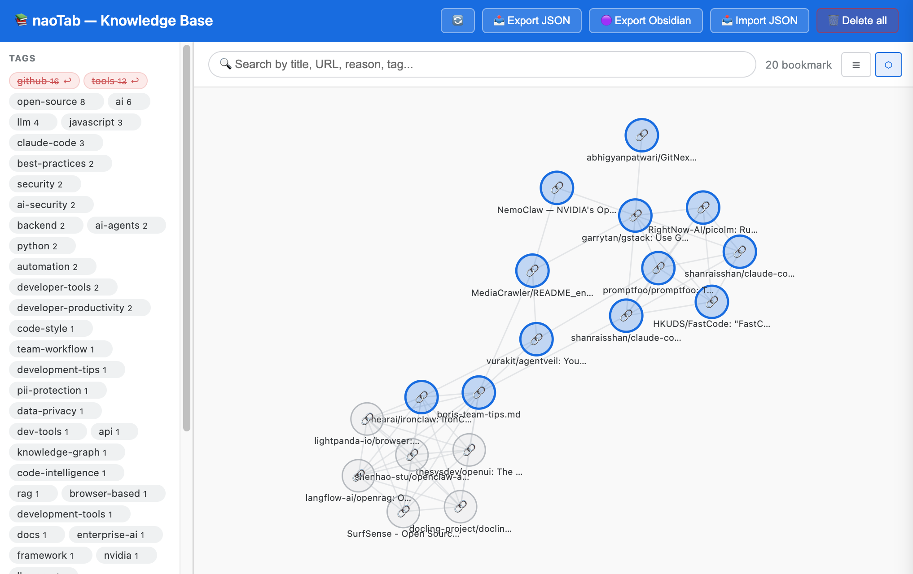

# 🗂️ naoTab — Kho kiến thức cá nhân từ browser tabs

> 🇬🇧 [View English version](./README.md)

Chrome Extension (Manifest V3) biến các tab trình duyệt thành một **kho kiến thức cá nhân** có tổ chức, tìm kiếm được — không cần server, không cần backend, toàn bộ chạy cục bộ trong extension.

---



---

## ✨ Tính năng

- **Lưu tab kèm context** — thêm summary, lý do lưu và tags cho bất kỳ tab nào
- **Brain Visualize** — đồ thị lực D3.js; node = bookmark, cạnh nối = tags chung; node xanh = có summary, xám = chưa có
- **List view** — danh sách card có tìm kiếm toàn văn theo title, URL, lý do và tags
- **Node panel** — click bất kỳ node hoặc card để mở panel chi tiết với form chỉnh sửa inline
- **Loại trừ tag khỏi đồ thị** — ẩn tạm kết nối của một tag mà không xóa, giúp dọn dẹp đồ thị
- **Tích hợp AI** (tùy chọn, tắt mặc định) — tự động gợi ý tags và summary qua OpenAI, Claude, Groq, Ollama, OpenRouter hoặc bất kỳ provider tương thích OpenAI
- **AI Suggest trong panel** — chạy lại AI trên bookmark đã lưu ngay từ panel chi tiết
- **AI Batch** — một click để AI hoá toàn bộ node đang hiển thị/đang filter; bỏ qua node đã có summary; thanh tiến trình realtime, node đổi màu ngay khi xong
- **Đọc meta SEO** — đọc meta tags khi lưu (og:description, keywords, author...); tiết kiệm token gấp ~10 lần so với scrape body
- **Lưu cả window** — lưu hàng loạt toàn bộ tab, mỗi tab được đọc meta riêng
- **Export Obsidian** — ZIP các file `.md` với YAML frontmatter, mở thẳng vào Obsidian
- **Export / Import JSON** — backup và restore toàn bộ dữ liệu
- **100% cục bộ** — toàn bộ dữ liệu trong `chrome.storage.local`, không gửi ra ngoài ngoại trừ lệnh gọi AI tùy chọn

---

## 📦 Cài đặt

1. Tải về hoặc clone repo này
2. Mở `chrome://extensions/`
3. Bật **Developer mode** (góc trên phải)
4. Nhấn **Load unpacked** → chọn thư mục này
5. Ghim extension vào thanh công cụ

---

## 🚀 Cách dùng

### Lưu tab
| Thao tác | Cách làm |
|---|---|
| Lưu tab đang xem | Nhấn **💾 Tab this** trên toolbar |
| Lưu tab bất kỳ | Nhấn **💾** cạnh tab trong danh sách |
| Lưu cả window | Nhấn **💾 Save window** — đọc meta cho từng tab |

Điền summary (tùy chọn), lý do lưu (tùy chọn) và tags. Nếu AI bật, nhấn **✨ AI Suggest**.

### Brain Visualize (Graph view)
- View mặc định khi mở Knowledge Base
- 🔵 **Node xanh** = đã có summary (AI hoặc tự nhập) · ⚪ **Node xám** = chưa có summary
- **Click node** → panel bên phải mở ra; node kết nối highlight, node còn lại mờ đi
- **Double-click node** → mở URL trong tab mới
- **Click nền** → reset highlight, đóng panel
- **Kéo node** để sắp xếp lại layout

### Loại trừ tag khỏi đồ thị
Trong sidebar trái, hover vào tag → nhấn **✕** để loại trừ tag đó khỏi các cạnh nối. Tag chuyển đỏ gạch ngang. Nhấn **↩** để khôi phục. Hữu ích khi tag generic như `github` nối quá nhiều node không liên quan.

### Chỉnh sửa bookmark
Click node hoặc card → chỉnh summary, lý do và tags trong panel → **💾 Save**.

### AI Suggest trong panel
Nếu AI đã cấu hình, nút **✨ AI Suggest** xuất hiện trong panel. Dùng meta đã lưu để tạo lại tags và summary.

### Cài đặt AI
Nhấn **⚙️** → chọn preset provider → nhập API key và model → **🧪 Test connection** → **💾 Save Settings**.

---

## 🤖 Tích hợp AI

| Provider | Định dạng API |
|---|---|
| OpenAI, Groq, Ollama, OpenRouter, tùy chỉnh | OpenAI-compatible (`/chat/completions`) |
| Anthropic (Claude) | Native Anthropic API (`/messages`) |

AI chỉ đọc meta tags (~75 token) thay vì toàn bộ nội dung (~750 token) — **tiết kiệm gấp 10 lần**.

AI **tắt theo mặc định**. Gợi ý tags offline (keyword + domain) luôn hoạt động không cần API key.

---

## 🗄️ Schema dữ liệu

```json
{
  "id": "1712345678901",
  "url": "https://...",
  "title": "Tiêu đề trang",
  "reason": "Lý do lưu",
  "summary": "Tóm tắt do AI hoặc người dùng nhập",
  "tags": ["rust", "async"],
  "favIconUrl": "https://...",
  "pageMeta": {
    "description": "...",
    "ogTitle": "...",
    "keywords": "...",
    "author": "...",
    "siteName": "...",
    "ogType": "...",
    "ogImage": "...",
    "lang": "en",
    "canonical": "https://..."
  },
  "savedAt": "2024-01-01T00:00:00.000Z",
  "updatedAt": "2024-01-01T00:00:00.000Z"
}
```

---

## 🔒 Quyền truy cập

| Quyền | Lý do |
|---|---|
| `tabs` | Đọc title, URL và favicon của các tab đang mở |
| `storage` | Lưu bookmarks và settings cục bộ |
| `unlimitedStorage` | Bỏ giới hạn 10MB mặc định |
| `scripting` + `host_permissions` | Đọc meta tags trang khi cần |

---

## 🛠️ Phát triển

Sau khi sửa file, mở popup và nhấn **🔄** để reload extension.

```
naoTab/
├── manifest.json              # Manifest V3
├── popup.html / popup.css / popup.js   # Popup extension
├── app.html / app.js          # Trang Knowledge Base
├── settings.html / settings.js # Cài đặt AI provider
├── storage.js                 # Dùng chung: CRUD + settings + AI
├── d3.min.js                  # D3.js v7 (bundle cục bộ — CSP)
├── jszip.min.js               # JSZip (bundle cục bộ — CSP)
└── icons/                     # Icon extension
```

---

## 🗺️ Kế hoạch phát triển

- [ ] Đồng bộ Google Drive
- [ ] Dark mode
- [ ] Phát hiện tab trùng lặp
- [ ] AI tự động nhóm bookmark
- [ ] Tích hợp lịch sử trình duyệt

---

## 📄 Giấy phép

MIT — xem [LICENSE](./LICENSE)
